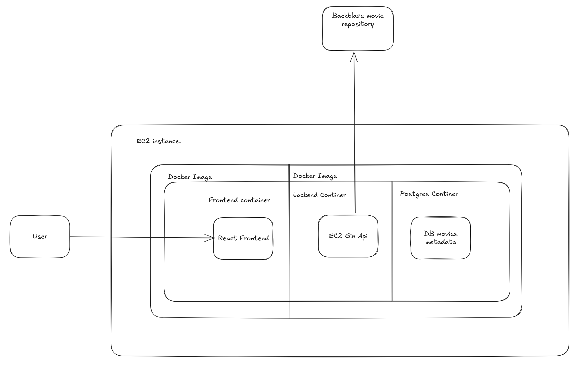
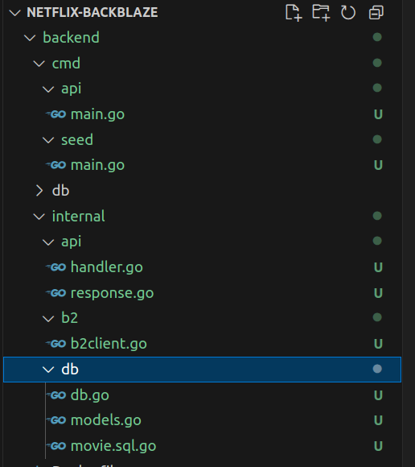
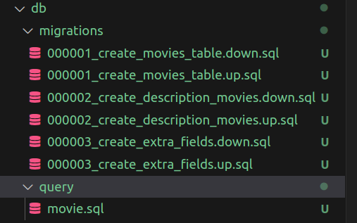
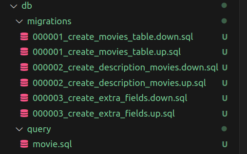
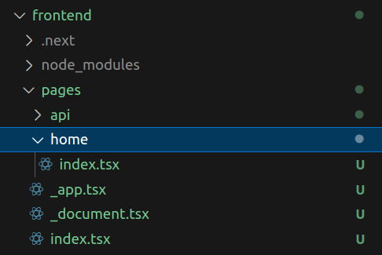
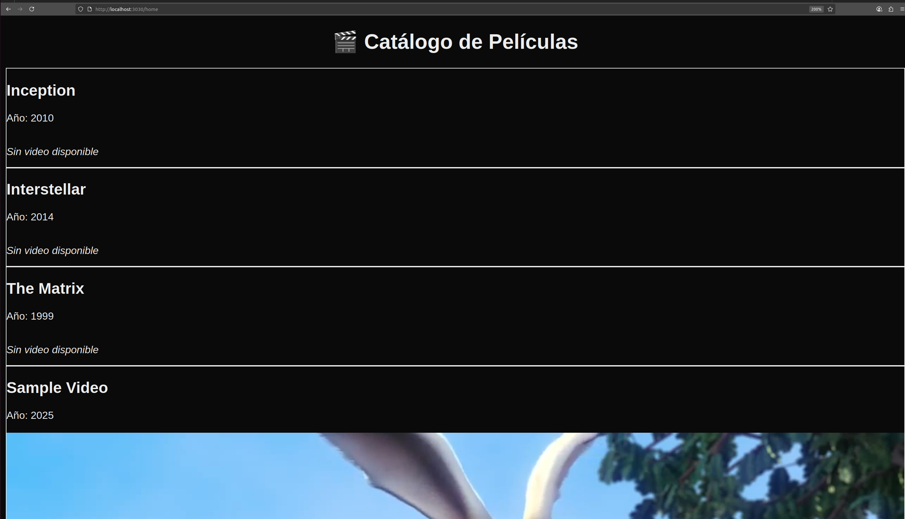
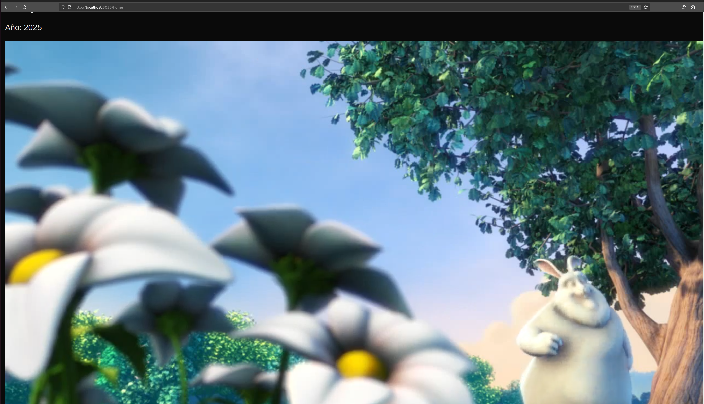

 # 🎬 Netflix-Backblaze: Monolithic B2 Video App

This project is a monolithic deployment of a simple Netflix-like application, built for personal experimentation and architectural prototyping.
## 🎯 Goals

    Test Backblaze B2 as a blob storage solution.

    Explore the B2 API for private video hosting with signed URLs.

    Create a minimal React + Golang project with a clean, extensible architecture.

    Use sqlc as a type-safe, ORM-free database engine.

    Deploy everything in Docker containers on a single EC2 instance.

    Manage infrastructure using Terraform.

---

## 🧱 Architecture


---

## 🖥️ Hardware

    EC2 Instance: Hosts all services in containers (frontend, backend, PostgreSQL)

## 🧠 Software Stack
    Docker: Containerized deployment

    Golang (Gin): Backend API

    React: Frontend UI

    PostgreSQL: Movie metadata

    Backblaze B2: Video file storage

    Terraform: Infrastructure provisioning


## 🔧 Backend



### 🗂️ cmd/ — Entry Point

Contains the main() function, sets up routes and CORS, initializes DB + B2 client.
```
make seed
```
```go
// Extract from main.go
r.GET("/movies", func(c *gin.Context) {
	dbMovies, _ := queries.ListMovies(context.Background())
	movies := api.ConvertToMovieResponses(dbMovies)

	for i := range movies {
		if movies[i].VideoUrl != "" {
			filename := path.Base(movies[i].VideoUrl)
			signed, _ := b2client.GetSignedURL(filename, 15*time.Minute)
			movies[i].VideoUrl = signed
		}
	}

	hardcoded := []api.MovieResponse{
		{ID: 101, Title: "Inception", Year: 2010},
		{ID: 102, Title: "Interstellar", Year: 2014},
		{ID: 103, Title: "The Matrix", Year: 1999},
	}

	all := append(hardcoded, movies...)
	c.JSON(http.StatusOK, all)
})
```
### 📦 internal/api/ — Serializers & DTO
```go
type MovieResponse struct {
	ID          int    `json:"id"`
	Title       string `json:"title"`
	Year        int    `json:"year"`
	Description string `json:"description,omitempty"`
	VideoUrl    string `json:"video_url,omitempty"`
}
func ConvertToMovieResponses(movies []db.Movie) []MovieResponse {
	var responses []MovieResponse
	for _, m := range movies {
		responses = append(responses, MovieResponse{
			ID:          int(m.ID),
			Title:       m.Title,
			Year:        int(m.Year),
			Description: m.Description.String,
			VideoUrl:    m.VideoUrl.String,
		})
	}
	return responses
}
```
### ☁️ internal/b2/ — Backblaze Signed URLs

```go
func (c *Client) GetSignedURL(filename string, validFor time.Duration) (string, error) {
	token, err := c.bucket.AuthToken(context.Background(), filename, validFor)
	return fmt.Sprintf("%s/file/%s/%s?Authorization=%s", c.bucket.BaseURL(), c.bucket.Name(), filename, token), nil
}
```
### 🗃️ internal/db/ — SQLC Queries
```sql
-- name: ListMovies :many
SELECT * FROM movies;

-- name: GetMovie :one
SELECT * FROM movies WHERE id = $1;

-- name: CreateMovie :one
INSERT INTO movies (title, year, description, url, video_url)
VALUES ($1, $2, $3, $4, $5)
RETURNING id, title, year, url, description, image_url, video_url, created_at;
```

## 🖼️ Frontend

Simple React frontend that fetches movie data and renders thumbnails.


## ✅ Results


Once metadata is seeded and videos uploaded, the app generates signed streaming URLs:


## 🧪 Future Improvements

    Authentication + access control

    Video tagging, genre filters, search bar

    Favorites, playlists, watch later

    Separate deployments (microservices)

    Advanced monitoring, alerts, backups